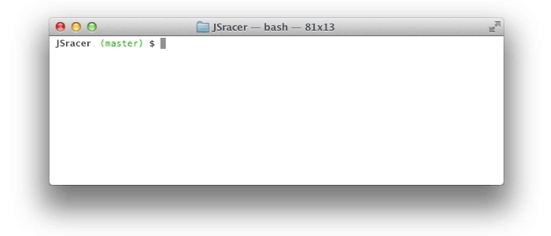

# JS Racer

## Введение

Врум врум! Мы собираемся создать простую игру под названием JS Racer. Правила просты: бросьте кубик и двигайтесь вперед. Нет никакой стратегии или принятия решений, просто надейтесь на удачу и [Math.random()](https://developer.mozilla.org/en-US/docs/Web/JavaScript/Reference/Global_Objects/Math/random)!

Игра - это гонка между двумя игроками. Оба игрока начинают игру в начале трека, бок о бок. Игроки по очереди бросают кубик и продвигаются по дорожке в зависимости от чисел на нем и делают это до тех пор, пока один из них не достигнет конца трека и не выиграет поединок.

Однако  в процессе создания нашей игры могут возникнуть некоторые проблемы: 
(1) управление состоянием игры (например, отслеживание позиций игроков)
(2) преобразование данных из одной структуры в другую (например, преобразование игровых данных в напечатанную доску).

Ниже приведена версия консольной игры. Если у вас есть желание - можете сделать ее с веб-интерфейсом, чтобы играть в браузере.

## Релизы
### Release 0: Сделать минималистичную версию игры

Нам необходимо создать рабочую версию *JS Racer*. Что это значит? Она должна запускаться, в ней должны каким-то образом передвигаться 2 машинки. Когда одна из них достигает финиша - об этом сообщается пользователю, а затем игра заканчивается.
На самом деле задание не такое простое как кажется! Рекомендуем очень внимательно изучить функции `setTimeout` и `setInterval`. Эти 2 функции работают достаточно интересно. Тут вы плавно начнете свое знакомство с понятием `Асинхронность`.

### Release 1: Добавить функции *(необязательно)*

Что сделало бы эту игру более увлекательной? Теперь, когда базовая версия игры работает, давайте посмотрим, не можем ли мы ее немного улучшить? Ниже приведены некоторые предложения по улучшению, но мы также можем добавлять и наши собственные функции.

- Зачем ограничивать игру двумя игроками, всегда называемыми `a` и `b`? Позвольте любому количеству игроков зарегистрироваться на гонку и выбрать свои собственные символы для имен.
- Вместо использования однобуквенных символов для каждого игрока мы можем использовать искусство [ASCII](https://sites.google.com/site/asciisandbox/art/vehicles), [конвертация слов](https://github.com/miketierney/artii)).
- Мы могли бы сделать игру более похожей на «Chutes and Ladders» («Горки и лестницы»), предоставляя бонусы для прогресса игрока или отключения питания, чтобы замедлить его или переместить назад.
- Мы могли бы уменьшить долю случайности в игре, давая игрокам больше контроля над тем, как они перемещаются по всем направлениям.

* Примечание: * Давайте попробуем проверить наши дополнения, если у нас будет такая возможность. Если нет, то ничего страшного, но мы все равно должны подумать о том, почему мы не смогли проверить эти дополнения и добавить их в файл `test.md`.

